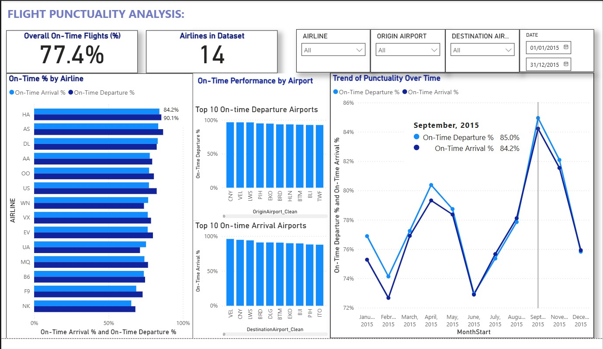

# Airline On-Time Performance Dashboard

## Overview

This project is an interactive dashboard built in Tableau to explore airline on-time performance.  
It enables users to see patterns and trends in flight delays by airline, route, and time of day.

## Features

- Visual summary of delay rates by airline
- Route-based performance analysis
- Time-of-day and seasonal delay insights
- Filterable views for flexible exploration

## Tech Stack

- Power BI
- Screenshots for visual reference

## Screenshot Previews

## What Could Be Improved

- **Add trend lines or clustering analysis** to highlight patterns in delays across different conditions.

## Contact

For questions or feedback, feel free to reach out:  
**Email:** folaopakunle@gmail.com  
**LinkedIn:** https://www.linkedin.com/in/folasadekhadijatopakunle
